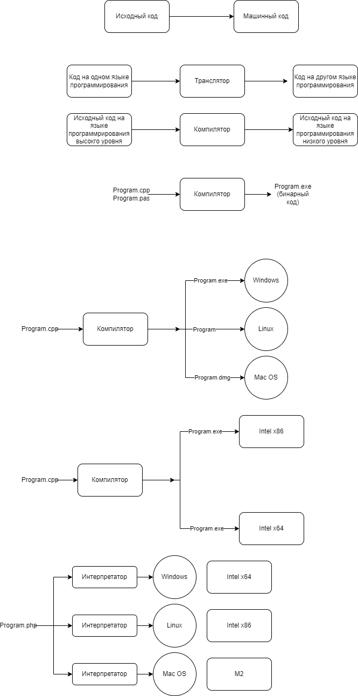

# Lesson 01

* Java != JavaScript

## 01. Базовые понятия и определения

* Программа - набор инструкций, в автоматическом режиме решающих какую-либо задачу.

* Комплексы программ автоматизируют бизнес-процессы

* Программу должен понимать компьютер, значит она должна быть написана на понятном ему языке.

* Какой язык понятен компьютеру? - бинарный код (1111...100101...10011)

* Язык программирования - понятен человеку, и его можно преобразовать в понятный язык для компьютера.

## 02. Языки программирования и их назначение

* `Pascal, Basic`
    * Область применения: подходят для изучения программирования
	* Плюсы: простые
	* Минусы: морально устарели

* `C/C++`
	* Область применения: системное ПО - операционные системы, драйвера, ПО для роботов
	* Плюсы: скорость работы программ
	* Минусы: сложность, медленная скорость разработки прикладного ПО

* `Python`
	* Область применения: машинное обучение, обработка данных, прикладное ПО (как правило стартапы)
	* Плюсы: простота, высокая скорость разработки
	* Минусы: скорость работы приложений, не всегда выдерживают высокие нагрузки

* `PHP`
	* Область применения: веб-сайты (интернет магазины)
	* Плюсы: низкий порог вхождения (очень простой язык)
	* Минусы: скорость работы приложений, неустойчивость к очень высоким нагрузкам

* `C#/Java`
	* Область применения: Enterprise/корпоративные системы - системы, которые работают с высокими нагрузками и постоянными изменениями, а также имеют сложные бизнес-процессы
	* Плюсы: высокая скорость работы, стабильность, огромное количество готовых решений, которые можно интегрировать в ваш продукт
	* Минусы: относительно высокий порог вхождения, медленная скорость разработки

## 03. Архитектура ЭВМ

* Устройство ввода (input) - клавиатура
* Устройство вывода (output) - экран
* Процессор (Processor) - основное вычислительное устройство, программа => инструкции процессору
* RAM (Random Access Memory) - оперативная память, малый объем, быстрая скорость, энергозависимая
* HDD/SDD - постоянная память, большой объем, медленная скорость, энергонезависимая

## 04. Компиляция, интерпретация

* Транслятор - программный инструмент, который переводит код на одном языке программирования в код на другом языке программирования, пример KPHP (`PHP -> C++`)

* Комплиятор - программный инструмент (разновидность транслятора), который переводит код с языка программирования высокого уровня в код на языке низкого уровня (машинный код).

* Особенность компилируемых языков - для каждой ОС или архитектуры компьютера программу нужно перекомпилировать.

* Для часто-переносимых прикладных программ это плохо - нужно перекомпилировать, а это потенциально долгая операция.

* Интерпретатор - программный инструмент (разновидность транслятора), который перевод код с языка программирования высокого уровня в машинный код во время исполнения (построчно, пооператорно).

* Summary:

```
Компилятор позволяет один раз перевести программу в машиный код и потом ее использовать в работе. Проблема - для разных операционных систем нужно перекомпилировать одну и ту же программу.

Чтобы решить эту проблему, придумали "компиляторы на лету" - интерпрераторы. Они способны переводить программу из исходного кода в машинны в момент запуска и делают это заново при каждом запуске программы. Делает он это в процессе работы программы, он смотрит на программу сверху вниз и каждую строчку в процессе работы переводит в машинный код.

Каждая компания-вендор языка программирования выпускает интерпретаторы для своих языков и их можно установить на компьютер. Если нет интерпретатора на вашем комьютере - они работать не будут. Обязательно нужен интерпретатор, а они есть для каждого типа устройств, ОС, процессоров и т.д. - КРОССПЛАТФОРМЕННОСТЬ

Интерпретаторы - медленные.
```



## 06. Переменные

* Переменная - это область оперативной памяти, в которой можно хранить какое-либо значение и это значение оттуда можно получать.

```java
int i; // объявление переменной, происходит выделение памяти
i = 10; // положили в переменную значение с помощью оператора присваивания

System.out.println(i); // вывели значение в консоль
```

* Объявление переменной - создание переменной с указанием ее типа.

```
ТИП название;
```

* Тип переменной определяет, какие значения в эту переменную можно класть. Например:

* `int` от `integer (целый)`, позволяет хранить целые числа.
* `double` вещественный тип, позволяет хранить дробные числа.
* `String` позволяет хранить строки.

## Дополнительно

* В круглых скобках мы указываем аругменты какой-либо функции, например `println(аргументы)`, аналог:

```
y = f(x)

y = f(10)
```

* `println` - `Print Line` - напечатать строку.


## Словарик

* `Source code` - исходный код
* `Binary code` - бинарный код
* `Compiler` - компилятор
* `Application` - приложение
* `Executable` - исполняемый
* `Deploy` - размещение приложения на сервере